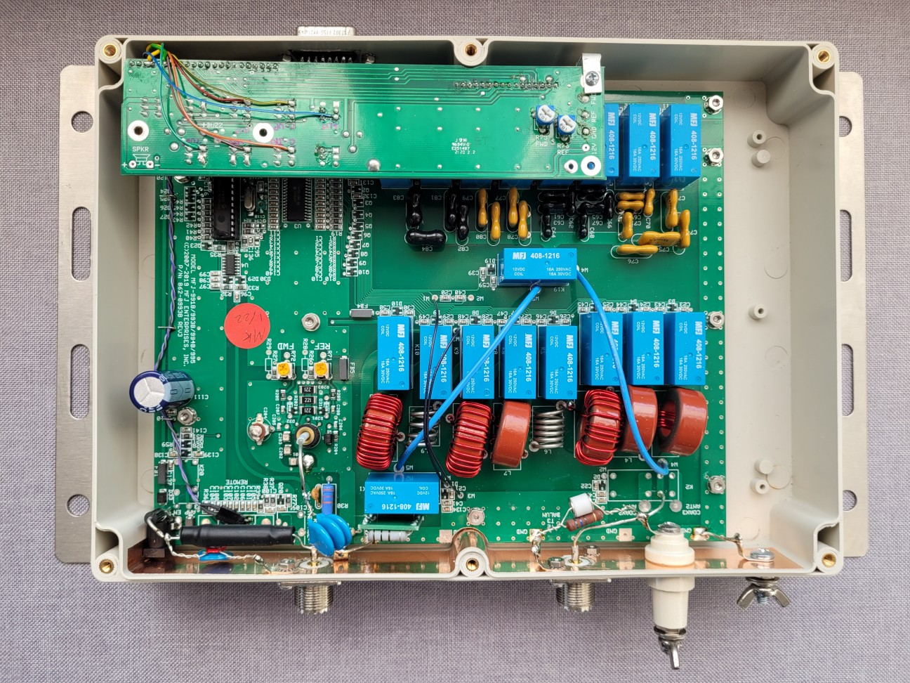
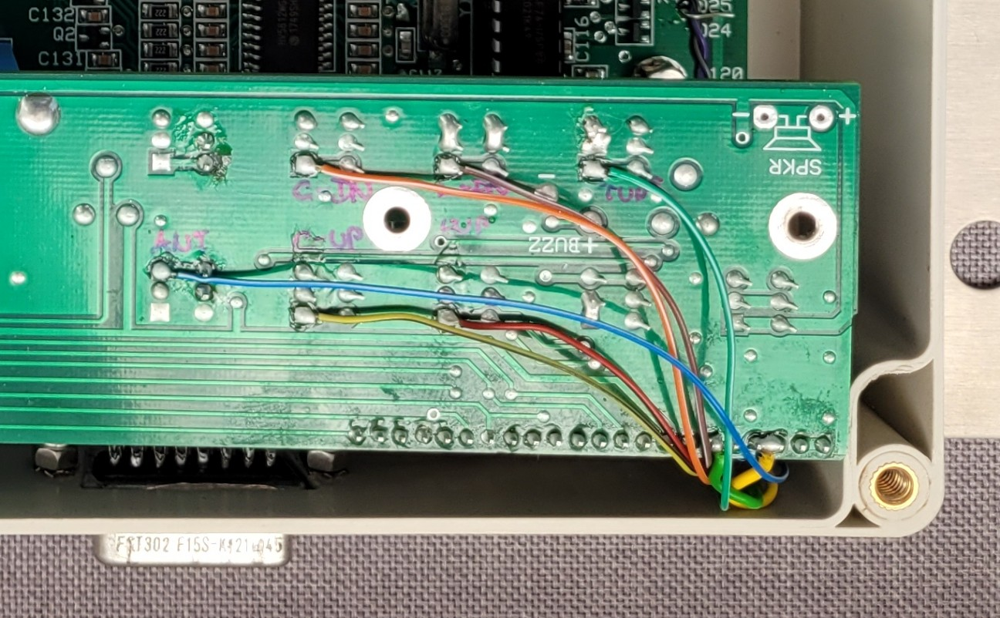
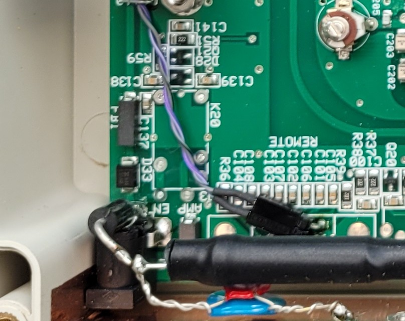
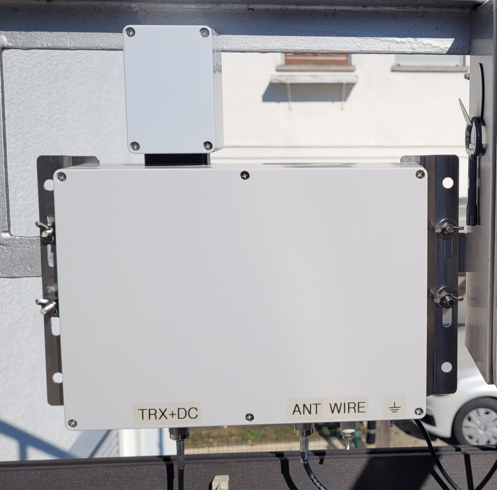
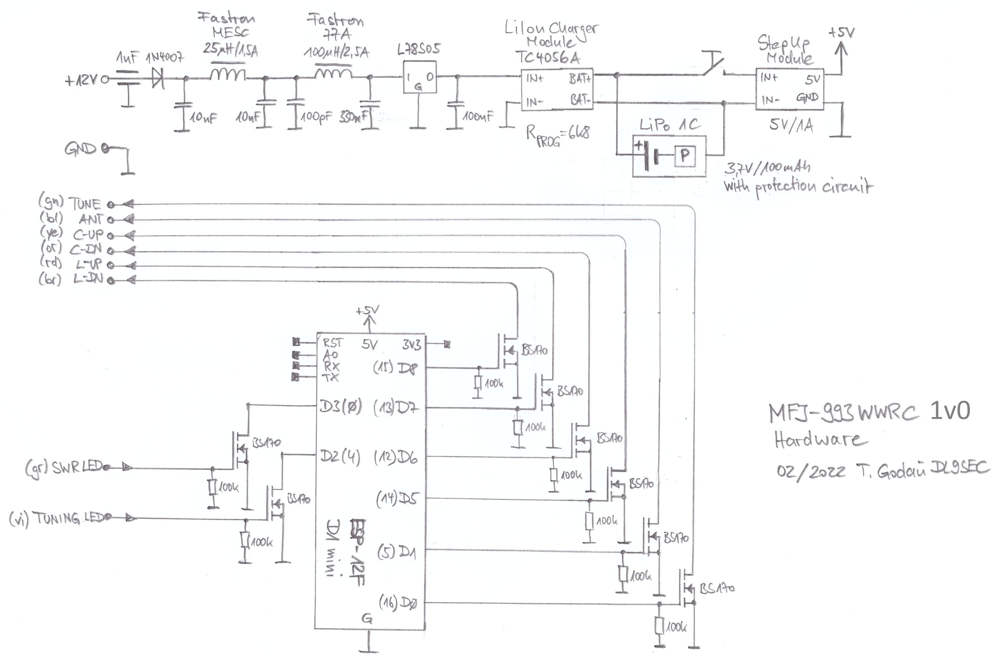
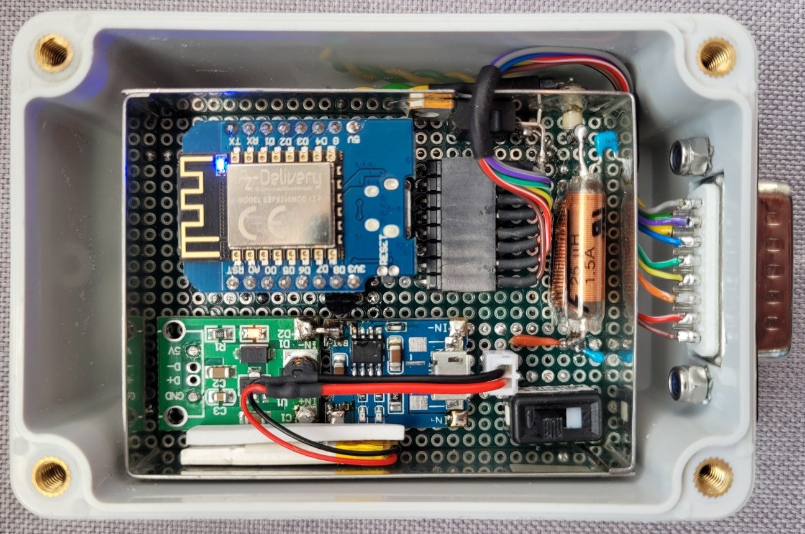
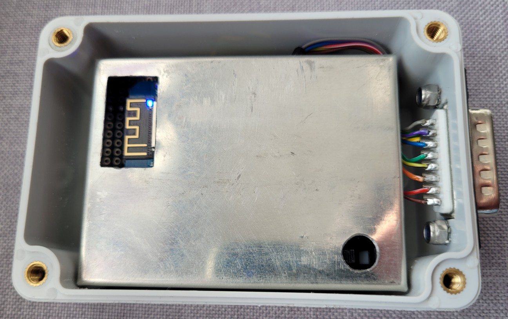
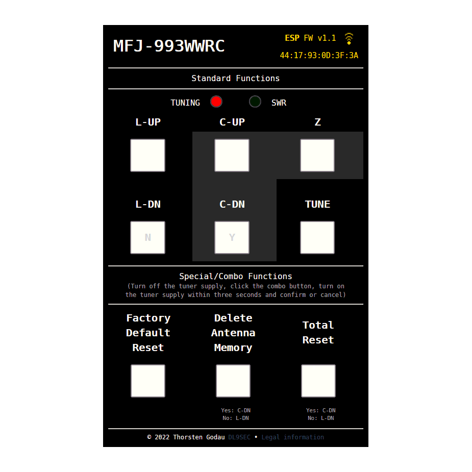

# MFJ-993WWRC

**A wireless web remote control for the MFJ-993BRT based on an ESP8266 (D1 mini / ESP-12F)**

## Introduction

Using a Chameleon V2L with UnUn at my balcony, I need an antenna tuner to match that "something" to my TRX's input impedance.
I tried various ATUs and decided to use a 300W [MFJ-993BRT](https://mfjenterprises.com/products/mfj-993brt) (the outdoor remote variant of the indoor metal cased [MFJ-993B](https://mfjenterprises.com/collections/tuners/products/mfj-993b)) which sits right beside my antenna feed point and is capable of 100W input power in digital modes.

The MFJ-993BRT uses the same baseboard and keypad (without LC display) but has some additional (partially very ugly soldered) "air wired" components (a DC bias tee and lightning protection parts). The firmware in the PIC microcontroller seems to be the same as for the MFJ-993B, but the software flow seems to be different and is controlled by "R55". By populating a 2x16 HD44780 compatible LC display and a 10k contrast potentiometer ("R73") and by unpopulating "R55", the device behaves as a MFJ-993B and can be calibrated and tested in this mode (do this at your own risk and be aware of the warranty conditions!).

Because the MFJ-993BRT has a very limited ability to be controlled externally (just by turning it on through the [MFJ-4117](https://mfjenterprises.com/collections/mfj/products/mfj-4117) bias tee while transmitting to start a retune), I wanted to build a wireless remote controller to access also the other functions described in the manual (e.g. factory reset, clear the antenna memory, ...).

Therefor I re-packaged and "prettified" the ATU hardware into another IP66 ABS housing and added a SUB-D15 connector to access the buttons, LEDs and a supply voltage, similar to the SUB-D9 connector at the MFJ-993B for the [MFJ-993RC](https://mfjenterprises.com/collections/tuner-accessories/products/mfj-993rc) wired remote control.

|                                      Button taps...                                   |                                    LED taps...                                  |
|:-------------------------------------------------------------------------------------:|:-------------------------------------------------------------------------------:|
|  |  |

The wireless web remote control add-on is plugged at the additional connector and sealed with a 3D-printed TPE gasket.

## Hardware

The heart of the WWRC is a "D1 mini" (ESP-12F) based on an ESP8266 WiFi microcontroller. To mimic the buttons, logic-level N-channel MOSFETs of type BS170 are used as open-drain FETs. The same configuration is used for the LED outputs to translate the voltage level from 5V to 3V3.

The controller is supplied by external 12V which are fed through a reverse polarity protecting diode, a filter network (optimised for high impedance at 1..30MHz) to avoid disturbance fed backwards through the supply at the shortwave bands. A linear voltage regulator of type L78S05 genrates 5V from the 12V which are fed to a one-cell LiIon charger module with a TC4056A which charges the connected LiPo battery and supplies a following 5V/1A step-up regulator. The charging current of the TC4056A is set to about 180mA by a 6k8 resistor Rprog. The battery is needed for all the MFJ-993BRT special modes, where buttons must be pressed while turning it on.

The whole circuit is assembled on a little bread board, which is put into a tiny tinplate box with appertures for the WiFi antenna and the power switch. The tinplate box is placed into a sealed IP66 ABS housing with SUB-D15 counterpart connector.

|                                     Inside the WWRC...                                   |                               Appertures in the tinplate box...                                  |
|:----------------------------------------------------------------------------------------:|:------------------------------------------------------------------------------------------------:|
|  |  |

## Software

The software is written for an Arduino ecosystem (the [ESP8266 filesystem uploader plugin](https://github.com/esp8266/arduino-esp8266fs-plugin) is needed to be able to upload the webserver files from the "/data" directory to the ESP SPIFFS) and offers a HTTP webserver where the MFJ-993BRT can be controlled through a web browser user interface and an over-the-air (OTA) update possibility.

### User interface

In the upper right corner the ESP firmware version, the WiFi status and the ESP MAC address is shown.
The upper section "Standard Functions" contains the TUNING (red) and SWR (green) LEDs and the "one-click" buttons:

* L-UP: Increases the inductance by one step
* L-DN: Decreases the inductance by one step
* C-UP: Increases the capacitance by one step
* C-DN: Decreases the capacitance by one step
* Z: Toggles the capacitance to be connected before or behind the inductance (by pressing C-UP/C-DN together)
* TUNE: starts a fine tuning run (a carrier must be transmitted before pressing TUNE)

The lower section "Special/Combo Functions" contains three functions additionally decribed in the manual, by turning off the power supply, press and hold two or more buttons at the same time and turn on the power supply again:

* "Facory Default Reset": Resets the tuner to its defaults (TUNE + L-UP)
* "Delete Antenna Memory": Delete the entire antenna memory (TUNE + ANT -> Confirm: C-DN, Cancel: L-DN)
* "Total Reset": Erase both antenna memories and reset to factory defaults (TUNE + C-UP + L-UP -> Confirm: C-DN, Cancel: L-DN)

### Arduino code

#### Prequisites

Copy the whole directory "MFJ-993WWRC_1v1" to your Arduino sketchbook directory. Install the [ESP8266 Arduino core](https://arduino-esp8266.readthedocs.io/en/latest/installing.html).

The "ESP8266WiFi" and "FS" libraries are ESP8266 core libraries and must nor be installed separately.

Serach for the following additional libraries in the library manager and install them:

* ezOutput
* ArduinoOTA

Download the following additional libraries from their websites and install them:

* [ESPAsyncTCP](https://github.com/me-no-dev/ESPAsyncTCP)
* [ESPAsyncWebServer](https://github.com/me-no-dev/ESPAsyncWebServer)

For the first time, the "D1 mini" must be programmed through the USB connection. Upload the "/data" content to the module. Compile and upload the sketch to the module.
If the WiFi is set up correctly and the module responds by entering the assigned IP to your web browser, the module can be re-programmed by the OTA update in the Arduino IDE.
Be aware to disable the OTA password protection (see source code) if you want to upload "/data" content ovber-the-air.

#### Some words about the source code

The code structure is very straight forward:

* Definitions and declarations
* Setup (DIs, DOs, webserver callbacks, OTA update setup and callbacks)
* Loop (cyclic OTA update and button handling, JSON string generation)

The button handling uses the non-blocking ezOutput library which enables timed button presses.

Don't forget to set the WiFi SSID and PSK for your network.
The WiFi is set to DHCP.

#### The webserver

All the webserver artifacts (webpage, stylesheet, JavaScript, favicon, font, legal information) are stored at the ESPs SPIFFS, which makes it easier to edit files.

If the root directory of the asynchronous webserver is called, iot responds with a html page "index.html". Every 800ms the browser requests a JSON string from the webserver which contains some dynamic information of the module (LED status, FW version and MAC address).
So the webpage, the graphics and JavaScript stuff is loaded just once, and only the dynamic elemnts are reloaded and displayed.

The button functionality is done by calling links, which triggers the button press and responds with the index page.

By this technique the logic and the user interface can be seperated. E.g. another ESP controller with tactile buttons and real LEDs can be used to fetch the JSON data and generate button presses by calling a link of the webserver to have a "browserless" remote control. 

## Project status and issues

This is the first public release which runs at my MFJ-993BRT so far. Nevertheless the project is still in experimental state.

There are some issues:

* The LEDs are showing weird things (e.g. TUNING on, while not tuning, SWR off although a solution with an SWR < 1.5 was found).
* The special functions couldn't be tested completely.
* Sometimes the ATU doesn't seem to behave as expected (I can see at my SWR meter, that there must be a solution, but the ATU says no).
* The manual tuning makes most sense in semi-automatic mode. As soon, as the SWR gets high the ATU starts to re-tune.

## Legal

**This project is not affiliated, associated, authorized, endorsed by, or in any way officially connected with MFJ Enterprises Inc. and just a hobby project for radio amateurs**

All product names, logos, brands, trademarks and registered trademarks are property of their respective owners. All company, product and service names used here are for identification purposes only. Use of these names, trademarks and brands does not imply endorsement.

The project is licensed under various open source licenses. See "[LICENSE](LICENSE)" for further information.
